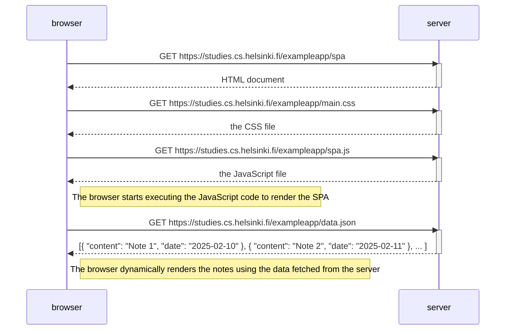

```mermaid    
    sequenceDiagram
        participant browser
        participant server

        browser->>server: GET https://studies.cs.helsinki.fi/exampleapp/spa
        activate server
        server-->>browser: HTML document
        deactivate server

        browser->>server: GET https://studies.cs.helsinki.fi/exampleapp/main.css
        activate server
        server-->>browser: the CSS file
        deactivate server

        browser->>server: GET https://studies.cs.helsinki.fi/exampleapp/spa.js
        activate server
        server-->>browser: the JavaScript file
        deactivate server

        Note right of browser: The browser starts executing the JavaScript code to render the SPA

        browser->>server: GET https://studies.cs.helsinki.fi/exampleapp/data.json
        activate server
        server-->>browser: [{ "content": "Note 1", "date": "2025-02-10" }, { "content": "Note 2", "date": "2025-02-11" }, ... ]
        deactivate server

        Note right of browser: The browser dynamically renders the notes using the data fetched from the server
```
