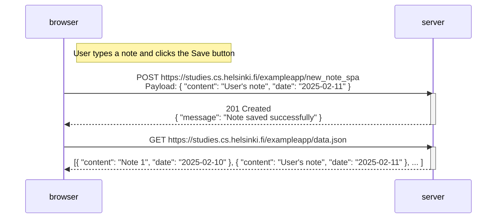

```mermaid
    sequenceDiagram
    participant browser
    participant server

    Note right of browser: User types a note and clicks the Save button
    browser->>server: POST https://studies.cs.helsinki.fi/exampleapp/new_note_spa<br>Payload: { "content": "User's note", "date": "2025-02-11" }
    activate server
    server-->>browser: 201 Created<br>{ "message": "Note saved successfully" }
    deactivate server

    browser->>server: GET https://studies.cs.helsinki.fi/exampleapp/data.json
    activate server
    server-->>browser: [{ "content": "Note 1", "date": "2025-02-10" }, { "content": "User's note", "date": "2025-02-11" }, ... ]
    deactivate server
```